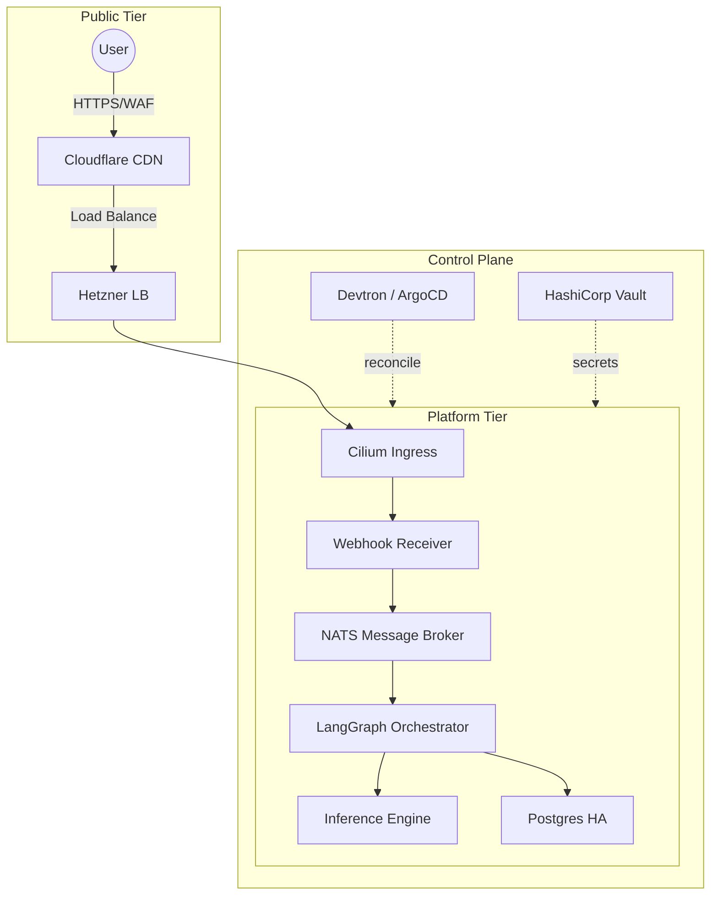
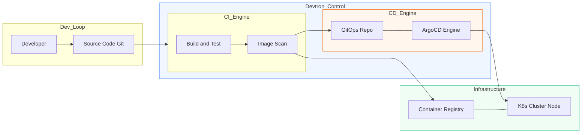
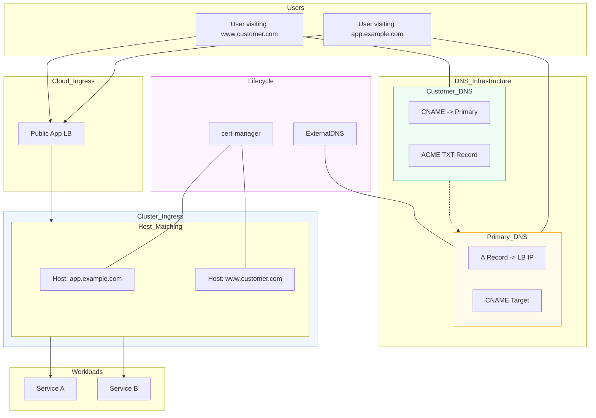

# Cloud-Native AI Platform (Hetzner & Talos)

This repository contains the architecture, infrastructure-as-code (**Terraform**), and **GitOps** manifests for a high-performance, security-hardened platform designed to run autonomous AI agents and stateful applications.

## 🚀 Quick Start in 5 Steps

1. **Infrastructure**: `cd infra` && `terraform apply`.
2. **Secrets**: Initialize **Vault** and **SOPS** via `SECURE_BOOTSTRAP.md`.
3. **Bootstrap**: Run the **Talos Bootstrap** GitHub Action to provision the control plane.
4. **Networking/CSI**: Deploy **Cilium** (eBPF) and **Longhorn** (Storage) via GitOps.
5. **Applications**: Promotion verified images via `scripts/promote.sh`.

👉 **[Master Technical Architecture (v3.8)](./docs/architecture.md)** | **[Emergency Runbook](./docs/runbook.md)**

## 🧭 Operational Matrix

| Domain | Focus | Technical Guide | Owner |
| :--- | :--- | :--- | :--- |
| **Project** | Overview & Contributing | **[CONTRIBUTING.md](./CONTRIBUTING.md)** | Engineering |
| **Security** | Posture & Vulnerabilities | **[SECURITY.md](./SECURITY.md)** | Security |
| **Disaster** | Emergency Recovery | **[docs/runbook.md](./docs/runbook.md)** | On-call SRE |
| **Infra** | Terraform & Talos | **[infra/README.md](./infra/README.md)** | Infra Lead |
| **GitOps** | Promotion & Secrets | **[gitops/README.md](./gitops/README.md)** | GitOps Lead |
| **Storage** | Backups & Retention | **[docs/backups-and-restore.md](./docs/backups-and-restore.md)** | DB Lead |
| **AI/ML** | Inference & Scraping | **[docs/egress.md](./docs/egress.md)** | AI Lead |
| **Observability** | SLOs & Dashboards | **[OBSERVABILITY.md](./OBSERVABILITY.md)** | SRE Lead |
| **DevEx** | Building & Testing | **[TESTING.md](./TESTING.md)** | CI/CD Lead |

---

## 🏗️ System Overview (v3.8)

The following diagram provides an executive view of the traffic flow and management components. Detailed layers (Network, Cluster, Logic) are found in **[docs/architecture.md](./docs/architecture.md)**.



---

---

## 🏁 Production Validation & Acceptance

The platform is considered ready for production workloads when the following criteria are met:

### 1. End-to-End Latency Validation

- **Public API**: P95 response time must be **< 200ms**.
- **AI Pipeline**: E2E latency from Webhook Ingest to DB Write must be **< 10s** for standard reasoning models.
- **Inference Stability**: Zero LLM timeouts under 2x expected peak load.

### 2. Security & Compliance

- **Zero Local Secrets**: 100% of runtime secrets must be injected from **Vault** or **SOPS**.
- **Supply Chain Integrity**: Admission Controllers must block any image without a valid **Cosign** signature.
- **Audit Trace**: All administrative `talosctl` and `kubectl` actions must appear in the **Audit Pipeline**.

### 3. High Availability & Recovery

- **RTO/RPO Compliance**: Recovery of any stateful service from S3 snapshots must take **< 30 minutes**.
- **Cluster Quorum**: The cluster must withstand the simultaneous loss of any two worker nodes or one control plane node without data loss.

---

## 🔑 Identity & Access Management (IAM)

The platform utilizes **Authentik** as its centralized "Truth Layer" for and authorization, ensuring a uniform security posture across all applications and management tools.

### 1. Centralized OIDC/SAML Provider

- **Unified Identity**: Authentik acts as the single source of truth for both public-facing customers and internal DevOps operators.
- **Enterprise Ready**: Supports OIDC, SAML, and SCIM for automated user provisioning and cross-platform compatibility (e.g., integrating with external LDAP or Social logins).
- **Hardened MFA**: Mandatory Multi-Factor Authentication (TOTP/WebAuthn) is enforced for all administrative and operator-level roles.

### 2. Zero-Trust Access Policies

- **Contextual Security**: Access is granted based on user identity, group membership, and network context (e.g., requiring **NetBird** VPN for admin UI access).
- **Service Integration**: Critical platform tools (Grafana, Longhorn UI, Devtron Dash) are integrated via Authentik OIDC, eliminating "shadow" local accounts.
- **Audit Traceability**: Every login and authorization event is captured and forwarded to the centralized **Audit Pipeline** for real-time monitoring.

### 3. GitOps Lifecycle Management

- **Codified IAM**: All Authentik Providers, Applications, and Outposts are defined as manifests in the `gitops/` repository, ensuring the IAM configuration is versioned and reproducible.
- **Secret Integration**: Authentik client secrets and database credentials are encrypted at rest using **SOPS/Vault**, following the platform's overarching governance strategy.

---

## ⚡ Performance & Reliability

The platform achieves low-latency and high throughput by optimizing every segment of the traffic path:

### 1. Edge Web Acceleration

- **HTTP/3 & QUIC**: Enabled at the Cloudflare edge to reduce handshake latency and improve performance over lossy networks.
- **Aggressive Caching**: Static assets and large media are served from CDN edges, offloading the origin LBs by >80%.
- **Brotli Compression**: Multi-tier compression (Edge + Gateway) reduces payload size for faster client delivery.

### 2. High-Speed Internal Networking

- **Cilium eBPF**: Replaces legacy `kube-proxy` with an eBPF-accelerated datapath, drastically reducing hop-counts and kernel context switches.
- **Connection Pooling**: Stateful services use **PgBouncer** to multiplex database connections, eliminating the high cost of TCP handshakes for every query.
- **Local NVMe Storage**: Database workloads are pinned to nodes with local NVMe storage for Tier-1 performance, with Longhorn providing the cross-node durability layers.

### 3. Dynamic Scaling & SLOs

- **Event-Driven Scaling**: **KEDA** scales workloads based on real-time metrics (e.g., Message Queue depth or Cron) while **HPA** handles traditional CPU/RAM spikes.
- **Predictable Performance**: All workloads use strict Resource Requests/Limits to ensure **Guaranteed QoS** for critical backend services.
- **Observability-First**: SLO-driven dashboards provide real-time visibility into **P95 latency** and **Error Budgets**.

---

## 🔒 Security Posture

This platform is engineered with a **Defense-in-Depth** strategy, focusing on three core pillars:

### 1. Zero-Trust Access Control

- **Perimeter Hardening**: Hetzner Cloud Firewalls restrict `kube-api` and `talosctl` access to a whitelist of CI Runner IPs and the **NetBird WireGuard** CIDR.
- **Identity-First Ingress**: Internal management tools (Grafana, Admin UI) are isolated behind a **Private Gateway** and required VPN mesh connectivity.
- **Audit Pipeline**: All API interactions are captured via Kubernetes Audit Logs and streamed to **Loki** for real-time detection of unauthorized RBAC changes.

### 2. Software Supply Chain Security

- **Immutable Artifacts**: Use of **Talos Linux** ensures an immutable, read-only root filesystem with no SSH/Shell entry points on nodes.
- **Provenance & Verification**: Container images and Helm charts must be signed via **Cosign**. The CI pipeline verifies signatures before GitOps reconciliation.
- **Vulnerability Scanning**: Integrated Trivy/Clair scanning within the **Devtron** CI engine blocks builds that exceed defined CVE thresholds.

### 3. Data & Secret Governance

- **Encrypted GitOps**: All sensitive manifests (Secrets, ConfigMaps) are encrypted at rest in Git using **SOPS** and the `age` backend.
- **Volume Encryption**: Longhorn replicas utilize block-level encryption for customer data sitting on Hetzner NVMe volumes.
- **Backup Integrity**: etcd and Longhorn snapshots are encrypted and offloaded to S3 with object-lock immutability enabled.

---

## 📂 Repository Structure

```text
infrastructure/
├── .github/        # GitHub Actions Workflows
├── infra/          # Terraform (Hetzner) - VMs, LBs, Network
├── talos/          # Talos machine configuration templates
├── bootstrap/      # CI scripts to bridge TF and Talos
├── gitops/         # In-cluster manifests (ArgoCD/Devtron)
├── scripts/        # Operational scripts (Smoke tests, etc.)
└── docs/           # Technical documentation
    ├── performance.md
    ├── load-testing.md
    ├── ai-orchestration.md
    ├── security.md
    └── iam.md
```

---

## 🛠️ Key Decisions and Tradeoffs

| Decision | Why? | Tradeoff |
| :--- | :--- | :--- |
| **Talos Linux** | Immutable, API-driven, minimal attack surface. | Steeper operational learning curve than Ubuntu. |
| **Cilium Gateway** | eBPF performance and Gateway API future-proofing. | More complex initial setup than legacy NGINX. |
| **3 Control Nodes** | etcd quorum and HA; tolerates one CP failure. | Higher infrastructure cost vs single CP node. |
| **Longhorn HA** | Block-level replication and automated snapshots. | CPU/RAM overhead for data replication services. |

---

## ⚡ Deployment Sequence (v1.0 — Full Stack)

1. **Infrastructure**: Provision Hetzner network, 3 Control Plane VMs, and dedicated Worker Pools (`App`, `AI`, `DB`).
2. **Gateway**: Provision API LB and App LB; configure Cloudflare WAF and DNS zones.
3. **OS Layer**: Generate Talos configs with `iscsi` extensions; bootstrap etcd quorum and apply worker configs.
4. **Networking/CSI**: Install **Cilium eBPF** (Gateway API) and **Longhorn HA** (Storage).
5. **IAM & Secrets**: Initial bootstrap of **Vault** (Secrets) and **Authentik** (Identity).
6. **GitOps Engine**: Install **Devtron** and sync the `gitops/` repository.
7. **AI/ML Integration**: **Ollama** (Local LLMs), **Steel Browser** (Agentic Scraping), **Flowise** & **LangGraph** (Orchestration).
8. **App Promotion**: Deploy customer workloads (Nuxt/Go) and configure **HTTPRoutes** for domain traffic.
9. **Validation**: Run the **Production Acceptance Plan** (Smoke tests + Load tests).

---

## 🚀 Devtron GitOps Lifecycle

This platform utilizes **Devtron** as a unified management layer to orchestrate the entire application lifecycle, leveraging an integrated **ArgoCD** engine for GitOps-based continuous delivery.



### The Workflow steps

1. **CI Orchestration**: Devtron triggers a build upon Git commits, running security scans (Trivy/Clair) before pushing to the registry.
2. **GitOps Handoff**: Upon a successful build, Devtron updates the **GitOps Repository** with the new image tag and configuration.
3. **State Reconciliation**: The integrated **ArgoCD engine** detects the change in the GitOps repo and automatically reconciles the cluster to the "Desired State."
4. **Traffic Cutover**: Once pods are healthy, the **Cilium Gateway** (managed via HTTPRoutes in GitOps) begins routing traffic to the new version.

---

## 🚨 Emergency Runbook — Top Commands

- **Fetch Kubeconfig**: `talosctl kubeconfig . && export KUBECONFIG=./kubeconfig`
- **Talos Health Check**: `talosctl --talosconfig ~/secure-infra/talos/talosconfig health`
- **Check etcd Quorum**: `talosctl --talosconfig ~/secure-infra/talos/talosconfig etcd health`
- **Restart Kube-APIServer**: `talosctl --talosconfig ~/secure-infra/talos/talosconfig service restart kube-apiserver --nodes <CP_IP>`
- **Longhorn UI Access**: `kubectl port-forward -n longhorn-system svc/longhorn-frontend 8080:80`
- **Force ArgoCD Sync**: `argocd app sync <app-name>`
- **Restore etcd Snapshot**: `talosctl etcd restore --snapshot <file> --nodes <CP_IP>`

---

---

### 🌐 Multi-Domain & Customer Onboarding (v1.0)

This diagram illustrates how the platform handles traffic for both owned domains (e.g., `app.example.com`) and external customer domains (e.g., `www.customer.com`). It highlights the automated certificate issuance (ACME) and the SNI-based routing at the **Cilium Gateway**.


