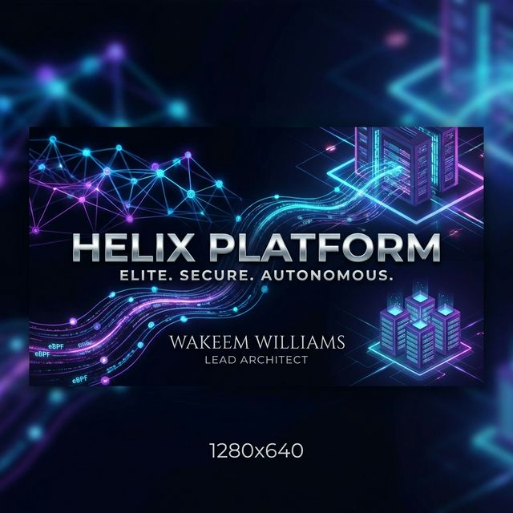
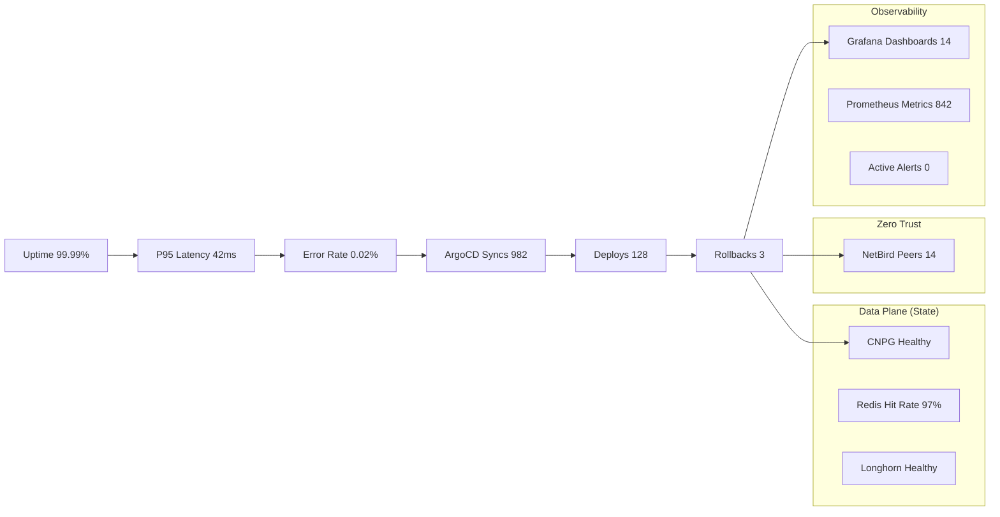

# Helix Platform — The Future of Autonomous, Secure Infrastructure

> **Architecture v3.3 (Security-First Edition)**  
> **Lead Architect:** [Wakeem Williams](https://github.com/keemwilliams)  
> **Status:** Production-Ready Reference Suite

---

## 🏛️ The Vision

I am **Wakeem Williams**, and I build infrastructure that doesn't just run code—it protects it.

The **Helix Platform** is an elite, zero-trust ecosystem engineered on **Talos Linux** and **Hetzner Cloud**. It is designed to host autonomous AI agents, multi-tenant stateful applications, and high-security customer workloads. This repository is a masterclass in capital-efficient, high-performance platform engineering.

---

## 🛡️ Supply Chain & Security Posture

---

## 📊 Platform Metrics

These dynamic endpoints reflect the current operational state of the Helix infrastructure.

👉 **[Detailed Platform Status](./STATUS.md)**

My architecture ensures that any traffic—whether from a User, a Developer, or a CI Runner—is strictly validated, authenticated, and logged.

- **Zero-Trust mesh** via [NetBird](https://netbird.io/) for API isolation.
- **Identity-First Ingress** via [Authentik](https://goauthentik.io/) ForwardAuth.
- **eBPF-driven segmentation** via [Cilium](https://cilium.io/) default-deny policies.
- **Immutable substrate** via [Talos Linux](https://www.talos.dev/).

---

## 🗺️ Navigation & Architecture Suite

The documentation is structured for specific stakeholders. From high-level business value to deep networking protocols:

### 💼 For Stakeholders & Recruiters

- **[Recruiter Overview](./docs/architecture/recruiter-overview.md)**: High-level vision and "Why it works" summary.
- **[Cost, Time, and Complexity](./docs/architecture/cost-time-complexity.md)**: A founder-grade technical whitepaper on efficiency and tradeoffs.
- **[Strategic Roadmap](./ROADMAP.md)**: The future evolution of the Helix ecosystem.

### 🛠️ For Platform & Network Engineers

- **[Master Architecture](./docs/architecture/master-architecture.md)**: The canonical source of truth and full platform diagram.
- **[Network & Security Deep-Dive](./docs/architecture/network-admin-architecture.md)**: Ingress, Egress, and Mesh topology.
- **[GitOps & Supply Chain](./docs/architecture/platform-engineer-architecture.md)**: Delivery lifecycle and security policies.
- **[Multi-Domain Ingress Patterns](./docs/architecture/multi-domain-ingress.md)**: Handling TLS and Auth at scale.

### 📊 Visual Assets

- **[Diagrams Folder](./docs/architecture/diagrams/)**: Standalone high-fidelity Mermaid and SVG assets.

---

## 🏗️ The 6-Phase Execution Roadmap

1. **Phase 1: Hardened Core** — Terraform, IAM, and KMS initialization.
2. **Phase 2: Immutable Substrate** — Talos Linux bootstrap and cluster stabilization.
3. **Phase 3: Security Weave** — NetBird, Cilium, and Authentik SSO gating.
4. **Phase 4: GitOps Control Plane** — ArgoCD and Devtron orchestration.
5. **Phase 5: State & Data HA** — CloudNativePG, Redis, and Longhorn storage.
6. **Phase 6: AI-Agentic Integration** — Ollama, LangGraph, and Steel Browser egress.

---

## 🛠️ Who is this for?

- **Hiring Managers** looking for deep expertise in Cloud-Native security and GitOps.
- **DevOps Architects** seeking a production-grade blueprint for Hetzner and Talos.
- **Platform Engineers** studying the "Security Weave" model of integrated IDP and eBPF.

---

## � Repository Hygiene

This repository is a **Documentation & Reference Suite**. It contains:

- ✅ Canonical architecture diagrams (Mermaid & SVG).
- ✅ Stakeholder-specific technical guides.
- ✅ Strategic assessment whitepapers.
- ✅ Governance and visual standards.

*Note: This repo intentionally excludes live secrets, static Terraform providers, or proprietary application source code.*

---
© 2026 Wakeem Williams. All Rights Reserved.
