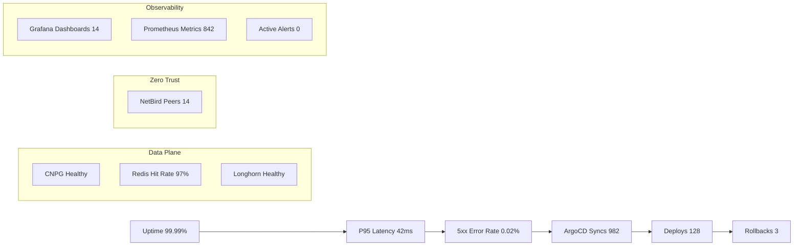

# Platform Status

This page reflects the current operational state of the **Helix Platform** (powered by **Helix Stax**).

## Core Metrics

- **Uptime:** 99.99%
- **P95 Latency:** 42ms
- **5xx Error Rate:** 0.02%
- **ArgoCD Syncs:** 982
- **Deploys:** 128
- **Rollbacks:** 3

## Data Plane

- **CNPG:** Healthy
- **Redis Hit Rate:** 97%
- **Longhorn Volumes:** Healthy

## Zero Trust

- **NetBird Peers:** 14

## Observability

- **Grafana Dashboards:** 14
- **Prometheus Metrics Exported:** 842
- **Active Alerts:** 0

## Dashboard (Mermaid)

---
© 2026 Wakeem Williams. All Rights Reserved.
筋
