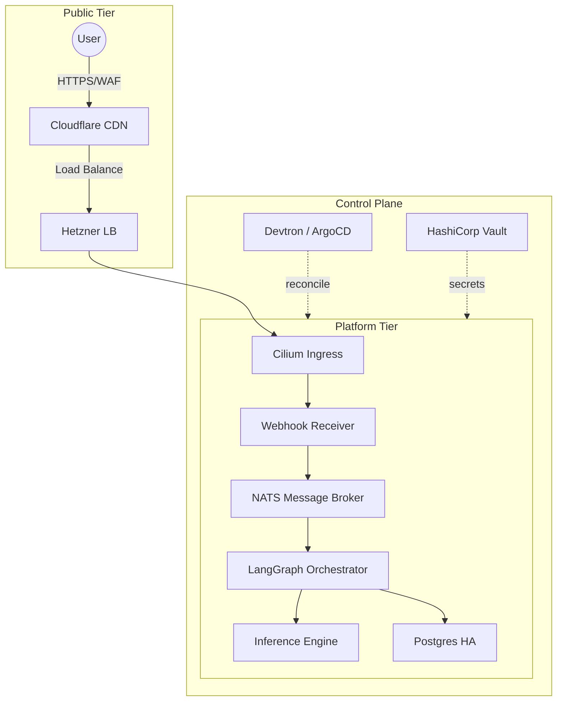

# System Architecture

## 🗺️ High-Fidelity Infrastructure (v3.8)

This document defines the high-fidelity architecture of the platform, structured by functional layers.

## 🗺️ System Overview

The following diagram provides an executive view of the traffic flow and management components.

## 🔍 Detailed Architecture Layers

For in-depth analysis of specific subsystems, refer to the focused diagrams below:

| Layer | Focus | Diagram | Owner |
| :--- | :--- | :--- | :--- |
| **Complete System** | End-to-end Big Picture | [Full Overview](./diagrams/overview-full.mmd) | Platform Lead |
| **Networking** | SNAT, Egress Gateway, WAF | [Network Topology](./diagrams/network.mmd) | Network Lead |
| **Infrastructure** | Node Pools, Taints, Storage | [Cluster Layout](./diagrams/cluster.mmd) | Infra Lead |
| **Logic Flow** | Webhook ➔ AI ➔ DB | [Application Sequence](./diagrams/flow-app.mmd) | AI Lead |
| **Lifecycle** | Provisioning ➔ Promotion | [Bootstrap Sequence](./diagrams/bootstrap.mmd) | CI/CD Lead |
| **Resilience** | Failure Modes ➔ Recovery | [Failure & Restore](./diagrams/failure-modes.mmd) | SRE Lead |

---

## 🏗️ Core Components & Ownership

## 🎯 Component Ownership

| Component | Responsibility | Performance Target |
| :--- | :--- | :--- |
| **Edge (Cloudflare)** | WAF, HTTP/3, Brotli, Caching | < 50ms Edge RTT |
| **Compute (Talos)** | API-driven, Immutable Nodes | < 1s Provisioning |
| **AI (Ollama)** | Local inference on High-CPU pool | < 5s Inference |
| **State (Postgres)** | HA, PgBouncer pooling, NVMe | < 10ms Query P95 |

## 🚀 Bootstrap Flow

1. **Terraform**: Provision Hetzner network + VM instances.
2. **Talos**: Apply machine configs and bootstrap etcd.
3. **Cilium**: Establish eBPF networking and Gateway API.
4. **GitOps**: Install Devtron/ArgoCD and sync platform components.
