# Cost, Time, and Complexity Analysis: The Helix Platform Suite

> **Platform Version:** v3.3 (Security-First Edition)  
> **Lead Architect:** Wakeem Williams  
> **Classification:** Founder-Grade Strategic Assessment

This document is a comprehensive technical whitepaper designed for stakeholders, principal architects, and financial planners. It provides the "What, How, and Why" for every core decision in the Helix Platform, from infrastructure costs to architectural complexity and delivery timelines.

---

## A. 📊 Detailed Cost Model

Our philosophy is "AWS-Grade Security at Hetzner Economics." We leverage Hetzner's bare-metal performance and cloud flexibility to achieve a 70% cost reduction over traditional hyperscalers.

### 1. Monthly Budget Projection

| Category | Component | Low (MVP/Dev) | Mid (Prod/Scale) | High (Enterprise) |
| :--- | :--- | :--- | :--- | :--- |
| **Infra** | Nodes (3x CPX31 + 3x CPX41) | ~$45 | ~$120 | ~$500+ |
| **Networking** | LB + NAT + Floating IPs | ~$20 | ~$20 | ~$60+ |
| **Storage** | Longhorn NVMe (60GB - 1TB) | ~$10 | ~$50 | ~$200+ |
| **Egress** | NAT Bandwidth + Proxies | ~$5 | ~$30 | ~$150+ |
| **CI/CD** | Actions + Registry Storage | Free Tier | ~$50 | ~$200 |
| **TOTAL** | | **~$80/mo** | **~$270/mo** | **~$1,110+/mo** |

- **WHAT:** A tiered operational budget covering hardware, network, and supply chain.
- **HOW:** Managed via [infra/terraform/](../../infra/terraform/) modules with strict resource limits.
- **WHY:** To ensure capital efficiency while maintaining absolute performance and high availability.

### 2. Cost Drivers & Savings

- **Heavy AI Compute:** AI inference nodes in the **EgressPool** are the primary variable cost. **KEDA** is used to scale these to zero during off-peak hours.
- **Data Retention:** Longhorn replica counts (2 for Dev, 3 for Prod) and S3 retention policies for **CNPG** WAL files drive storage costs.

**External References:**

- [Hetzner Pricing](https://www.hetzner.com/cloud)
- [ArgoCD Resource Management](https://argo-cd.readthedocs.io/en/stable/operator-manual/resourcelimits/)

---

## B. ⏱️ Unified Delivery Timeline

The sequence is engineered to establish the "Security Weave" before any operational data is deployed.

| Phase | Duration | Activity | Prerequisite |
| :--- | :--- | :--- | :--- |
| **Phase 1** | 2 Hours | **Terraform Infrastructure** | Cloud API Keys |
| **Phase 2** | 1 Hour | **Talos Cluster Bootstrap** | Phase 1 success |
| **Phase 3** | 4 Hours | **Zero-Trust Mesh & Networking** | NetBird Tokens |
| **Phase 4** | 8 Hours | **Identity & GitOps Control Plane** | OIDC Provider |
| **Phase 5** | 6 Hours | **High-Availability Data Plane** | Storage Classes |
| **Phase 6** | 1-2 Days | **Application Onboarding** | Full Validation |

- **WHAT:** A phased roadmap from bare hardware to a functional AI-driven ecosystem.
- **HOW:** Sequential rollout via [GitHub Actions](../../.github/workflows/) and [ArgoCD](../../gitops/platform/).
- **WHY:** Security-first sequencing (NetBird → Authentik → Apps) prevents "naked" API endpoints during the build phase.

**External References:**

- [Talos Linux Quickstart](https://www.talos.dev/v1.6/introduction/getting-started/)
- [ArgoCD Getting Started](https://argo-cd.readthedocs.io/en/stable/getting_started/)

---

## C. 🌡️ Complexity Heatmap

We prioritize "High Value" despite "High Complexity" for components like Authentik and Cilium, as they form the security backbone.



| Component | Rating | Reason for Complexity | Failure Mode |
| :--- | :--- | :--- | :--- |
| **Authentik** | **High** | Multi-flow auth logic & OIDC outposts. | Identity lockout / SSO outage. |
| **Cilium CNI** | **High** | eBPF policy auditing & L3-L4 rules. | Network isolation (Blackhole). |
| **ArgoCD** | **Medium** | App-of-apps pattern & Sync logic. | Out-of-sync state / Drift. |
| **Traefik v3** | **Medium** | Middleware chaining & IngressRoutes. | Path routing misconfiguration. |
| **Longhorn CSI** | **Medium** | Block-level replication & Snapshots. | Replica desync / I/O latency. |
| **NetBird** | **Low** | Simple WireGuard tokens. | Peer disconnected. |

- **WHAT:** An assessment of the operational burden for each platform pillar.
- **HOW:** Evaluated based on "Troubleshooting Effort" and "Stateful Risks."
- **WHY:** To allocate senior SRE bandwidth to High-Complexity/High-Value zones.

**External References:**

- [Cilium eBPF Architecture](https://docs.cilium.io/en/stable/overview/intro/)
- [Authentik Architecture](https://docs.goauthentik.io/docs/architecture/)

---

## D. ⚖️ Technical Tradeoff Matrix

Our choices favor **automation, security, and immutability** over "popular defaults".

| Tradeoff | Pros | Cons | Decision |
| :--- | :--- | :--- | :--- |
| **Traefik vs NGINX** | Native CRDs, Dynamic, v3 WASM | Higher learning curve | **Traefik** (Better GitOps native). |
| **Authentik vs OAuth2** | Full IDP, ForwardAuth, SSO | Resource intensive | **Authentik** (Unified Identity). |
| **NetBird vs Public** | Zero attack surface, WireGuard | Agent required on CI | **NetBird** (API Hardening). |
| **CNPG vs Managed** | S3 snaps, No lock-in, SOPS | Operational maintenance | **CNPG** (70% Cost Savings). |
| **Longhorn vs Ceph** | Native K8s, Easier Ops | CPU/RAM Overhead | **Longhorn** (Operational Speed). |

- **WHAT:** The "Why not X?" analysis for architectural vetting.
- **HOW:** Benchmarked against security compliance (OIDC/RBAC) and capital efficiency.
- **WHY:** To ensure every layer of the stack contributes directly to the **Wakeem Williams** platform vision of hardened, autonomous scale.

**External References:**

- [CloudNativePG vs RDS](https://cloudnative-pg.io/blog/postgresql-ha-cloudnative-pg-vs-managed-services/)
- [Traefik v3 Docs](https://doc.traefik.io/traefik/v3.0/)

---

## E. 📈 Founder's Dashboard & Metrics

We "Audit Everything" to ensure the platform remains within its SLOs.

### 1. Key Performance Indicators (KPIs)

| Metric | WHAT it measures | HOW it's calculated | WHY it matters |
| :--- | :--- | :--- | :--- |
| **P95 Latency** | User Experience | Traefik entrypoint bucket | Prevents UX degradation. |
| **Auth Fail %** | Security Perimeter | Authentik 401/403 rate | Detects credential stuffing. |
| **Sync Velocity** | Dev Velocity | ArgoCD sync count/hour | Measures GitOps efficiency. |
| **Mesh Density** | Zero-Trust Health | NetBird active peers | Ensures CI/Admin visibility. |

### 2. Prometheus Query Examples (PromQL)

```promql
# P95 Ingress Latency
histogram_quantile(0.95, sum(rate(traefik_entrypoint_request_duration_seconds_bucket[5m])) by (le))

# Successful GitOps deployments
sum(rate(argocd_app_sync_total{phase="Succeeded"}[24h]))
```

---

## F. 🛡️ Verification & Badges

All platform images are scanned, signed, and validated before they hit production.

| Item | Status Badge | Collection Method |
| :--- | :--- | :--- |
| **Build** |  | GitHub Actions Runner |
| **Security** |  | Trivy Vulnerability Scan |
| **Signature** |  | Kyverno verifyImages |

---
© 2026 Wakeem Williams. All Rights Reserved.
