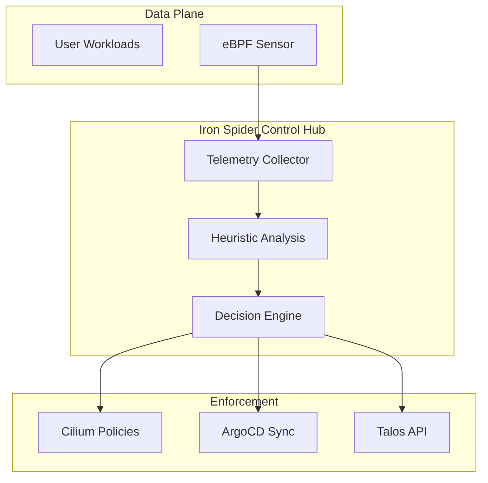

# 🕷️ Iron Spider — The Helix Autonomous Control Subsystem

> **Phase:** 3 (Beta Deployment)  
> **Strategic Goal:** Transform the platform from *Observable* to *Autonomous*.

## 🌌 The Vision

**Iron Spider** is the signature intelligence layer of the Helix Platform. Named after its multi-threaded "weave" into the kernel and network fabric, it serves as the central nervous system for self-healing infrastructure.

While traditional platforms rely on reactive alerts, **Iron Spider** uses **eBPF telemetry** and **Agentic Remediation** to anticipate failures before they impact the P95 latency of downstream customers.

---

## 🛠️ Core Capabilities

### 1. eBPF Network Weave

- **Visibility**: Deep kernel-level insights into packet drops, TLS handshakes, and process-level syscalls.
- **Enforcement**: Immediate, zero-latency network segmentation via [Cilium](https://cilium.io/) based on behavioral anomalies.

### 2. Predictive Telemetry

- **Model**: Time-series forecasting of resource pressure (Memory/CPU/IO).
- **Outcome**: Proactive node scaling or pod migration *before* OOM-kill cycles occur.

### 3. Agentic Remediation (Phase 6)

- **Engine**: LLM-driven operators that analyze Prometheus metrics and execute orchestrated runbooks (Terraform reapplies, GitOps syncs, or traffic redirection).

---

## 📐 Subsystem Architecture

---

## 🗺️ Strategic Milestones

| Milestone | Status | Description |
| :--- | :--- | :--- |
| **Foundation** | ✅ Done | Prometheus/Grafana stack with custom PromQL weave. |
| **Observation** | ✅ Done | Exporting kernel syscalls via eBPF exporters. |
| **Remediation** | 🏗️ In-Progress | Integration with Kyverno for auto-labeling and pod recycling. |
| **Autonomy** | 📅 Roadmap | Full AI-agentic loop with automated incident post-mortems. |

---

## 🏗️ Who is this for?

- **Architects** studying the "Zero-Intervention" operational model.
- **SREs** looking to move beyond simple alertmanager paging.

---
© 2026 Wakeem Williams. All Rights Reserved.
