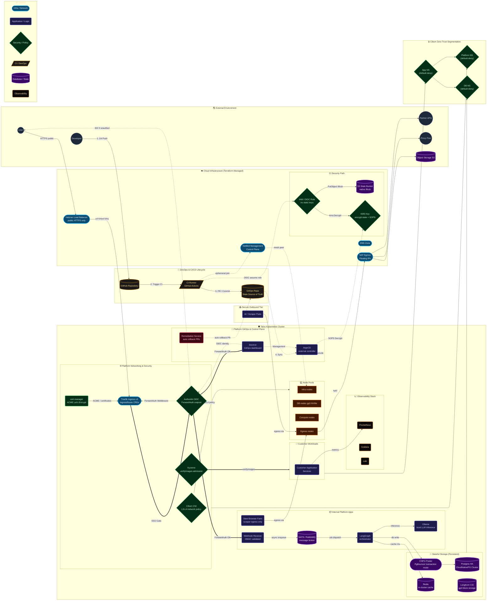

# Master Architecture — Devtron Platform on Talos

**Owner:** platform-team  
**Last validated:** 2026-02-23  

This document is the **canonical architecture** for the platform: ingress, egress, zero‑trust, GitOps, CI/CD, secrets, data, observability, and Devtron/ArgoCD boundaries. All other docs (recruiter, network admin, platform engineer, ingress) are derived from this.

---

## High-level goals

- Multi‑tenant, production‑grade Kubernetes on Talos.
- GitOps‑driven delivery via ArgoCD, surfaced through Devtron.
- Zero‑trust networking with NetBird and Cilium default‑deny.
- Multi‑domain ingress with Traefik + cert‑manager + Authentik.
- Strong supply chain: SBOM, Trivy, cosign, Kyverno verifyImages.
- HA data plane: CNPG, Redis, Longhorn.
- Clear Terraform vs GitOps vs Devtron ownership.

---

## Platform architecture (full diagram)

---

## Ownership boundaries

- **Terraform (infra repo)**  
  - LB, NAT, DNS, NetBirdMgmt, IAM, Buckets, KMS, base Talos cluster.
- **GitOps (gitops repo via ArgoCD)**  
  - Traefik, cert‑manager, Cilium, Kyverno, CNPG, Redis, Longhorn, observability, platform apps.
- **Devtron**  
  - Application onboarding, app‑level Helm values, environment configs, deployment pipelines (if used), dashboards.

---

## Installation order (high level)

1. Terraform: network, LB, DNS, IAM, S3, KMS, NetBirdMgmt, Talos cluster.
2. Cluster bootstrap: Cilium, Longhorn, CNPG, Redis.
3. Traefik + cert‑manager + Authentik outpost.
4. ArgoCD install and GitOps bootstrap.
5. Devtron install (external CNPG/Redis/NATS wired).
6. Observability stack (Prometheus, Grafana, Loki).
7. Kyverno in audit → enforce.
8. App onboarding (internal + customer workloads).
9. Final ingress exposure and SSO enforcement.

---

## Links to audience-specific docs

- **[Cost, Time, and Complexity Analysis](./cost-time-complexity.md)** (Founder-Grade Assessment)
- [Recruiter Overview](file:///c:/Users/MSI%20LAPTOP/Documents/Projects/helix-platform/docs/architecture/recruiter-overview.md)
- [Network Admin View](file:///c:/Users/MSI%20LAPTOP/Documents/Projects/helix-platform/docs/architecture/network-admin-architecture.md)
- [Platform Engineer View](file:///c:/Users/MSI%20LAPTOP/Documents/Projects/helix-platform/docs/architecture/platform-engineer-architecture.md)
- [Multi-Domain Ingress Detail](file:///c:/Users/MSI%20LAPTOP/Documents/Projects/helix-platform/docs/architecture/multi-domain-ingress.md)
